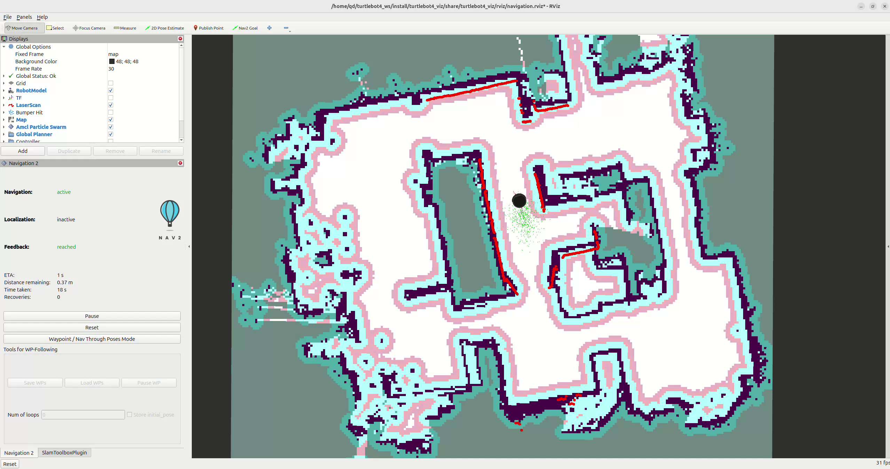
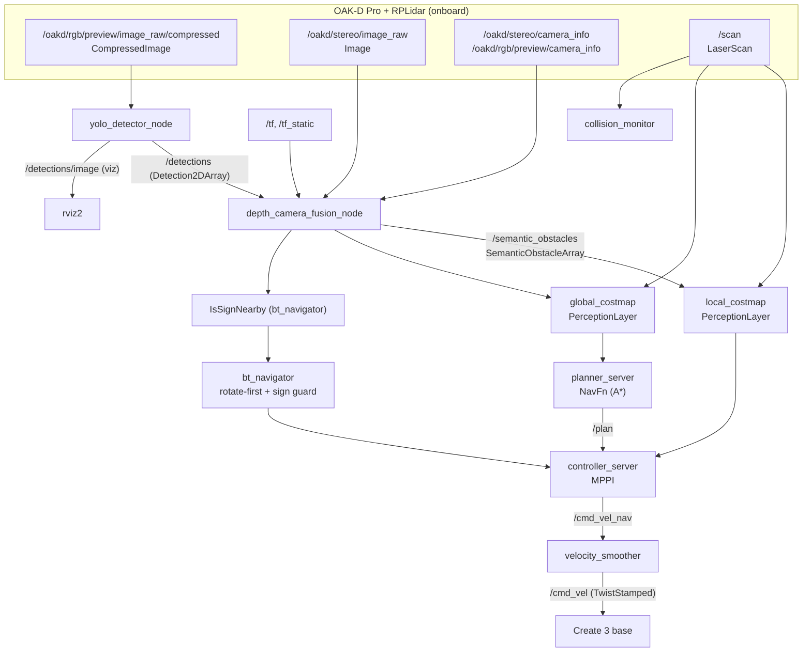

# TurtleBot 4 Semantic Perception Navigation

**Learning-based perception + geometric depth fusion + costmap-driven planning
on a TurtleBot 4 with OAK-D Pro and RPLidar, running Nav2 onboard the robot.**

This ROS 2 (Jazzy) workspace adds camera-based semantic obstacle detection to
the standard Nav2 LiDAR navigation stack. A fine-tuned YOLO model detects
traffic signs (STOP and DO NOT ENTER), a fusion node localizes them in 3D using
OAK-D stereo depth, and a custom Nav2 costmap layer plus behavior tree make the
robot **stop at a STOP sign** and **reroute around a DO NOT ENTER sign**, while
retaining the full LiDAR costmap for geometric obstacle avoidance.

---

## Demo

Screencast of the robot stopping at a STOP sign and rerouting around a
DO NOT ENTER sign:

<video src="https://github.com/QuangMDoan/tb4a/raw/main/screencast.webm" poster="https://github.com/QuangMDoan/tb4a/raw/main/screencast_poster.png" controls width="720">
  Your browser does not support the video tag.
  Watch it here: https://github.com/QuangMDoan/tb4a/raw/main/screencast.webm
</video>

On renderers that strip the video player, click the thumbnail to watch:

[](https://github.com/QuangMDoan/tb4a/raw/main/screencast.webm)

If the inline player does not load, [download / watch `screencast.webm`](screencast.webm).

---

## Package Overview

| Package | Language | Role |
|---------|----------|------|
| **tb4_perception** | Python | `yolo_detector_node`: OAK-D RGB (compressed) to `Detection2DArray` using a fine-tuned traffic-sign model |
| **tb4_perception_integration** | Python | `depth_camera_fusion_node`: `Detection2DArray` + stereo depth to `SemanticObstacleArray` |
| **tb4_perception_layer** | C++ | Nav2 `PerceptionLayer` costmap plugin, `IsSignNearby` BT condition node, and the semantic messages |
| **turtlebot4_navigation** | YAML/XML | Modified Nav2 config: costmap layers, MPPI controller, rotate-first + sign-guarded behavior tree, onboard launch |
| **turtlebot4** *(upstream, modified)* | C++ | Robot description, messages, base node, `tb4` helper script |
| **turtlebot4_desktop** *(upstream)* | RViz | RViz launch and config |

---

## Two-Sign Behavior

Both sign types share **one** trigger (`IsSignNearby`). The difference between
"stop then go" and "stop then reroute" is entirely the costmap keep-out that the
fusion node writes per class:

| Sign | Keep-out radius | Cost | Persistence | Result |
|------|-----------------|------|-------------|--------|
| **stop sign** | 0.08 m | 120 (non-blocking) | transient | BT pauses 2 s, then the robot drives **through** |
| **do not enter** | 0.5 m | 254 (lethal) | latched in `map` frame | planner reroutes **around** it; block is remembered after it leaves view |

The DO NOT ENTER keep-out latches persistently once the robot reacts (within
`persistent_react_distance` = 3.0 m, which exceeds the 2.5 m BT stop distance so
the reroute is committed instead of snapping back).

> **Note:** sign detection depends on the sign being adequately lit. In an unlit
> corner YOLO does not fire, the LiDAR reaches the physical sign first, and the
> robot can wedge on the raw obstacle before the semantic keep-out engages.

---

## Runtime ROS 2 Graph

Captured live from the running stack (`tb4 onboard up` + `tb4 bbox yolo-viz` + `tb4 viz`):



### Live nodes (perception + navigation)

```
Perception:  yolo_detector_node   depth_camera_fusion_node
Nav2:        bt_navigator   planner_server   controller_server   smoother_server
             behavior_server   velocity_smoother   collision_monitor   waypoint_follower
             local_costmap   global_costmap   map_server   amcl
             lifecycle_manager_localization   lifecycle_manager_navigation
Robot base:  turtlebot4_node   turtlebot4_base_node   create3_repub
             rplidar_composition   oakd / oakd_container
             robot_state_publisher   joint_state_publisher
Viz:         rviz2
```

### Key topics

| Topic | Type | Producer to Consumer |
|-------|------|----------------------|
| `/oakd/rgb/preview/image_raw/compressed` | `sensor_msgs/CompressedImage` | OAK-D to `yolo_detector_node` |
| `/detections` | `vision_msgs/Detection2DArray` | `yolo_detector_node` to `depth_camera_fusion_node` |
| `/detections/image` | `sensor_msgs/Image` | YOLO visualization (when enabled) |
| `/oakd/stereo/image_raw` | `sensor_msgs/Image` | OAK-D stereo depth to fusion |
| `/oakd/stereo/camera_info`, `/oakd/rgb/preview/camera_info` | `sensor_msgs/CameraInfo` | dual intrinsics to fusion |
| `/semantic_obstacles` | `tb4_perception_layer/SemanticObstacleArray` | fusion to both costmaps + `IsSignNearby` |
| `/fusion_debug_markers` | `visualization_msgs/MarkerArray` | fusion (optional, off by default) |
| `/scan` | `sensor_msgs/LaserScan` | RPLidar to costmaps + collision monitor |
| `/plan` | `nav_msgs/Path` | `planner_server` |
| `/cmd_vel_nav` to `/cmd_vel` | `geometry_msgs/TwistStamped` | controller to smoother to base |

---

## Fusion Pipeline (`depth_camera_fusion_node`)

1. Cache the latest `Detection2DArray`; pair it with each incoming depth frame
   (RGB and stereo use different timestamp bases, so no time synchronizer).
2. Back-project depth pixels to 3D points in the camera optical frame.
3. Voxel downsample (0.05 m) then RANSAC floor-plane removal.
4. Re-project surviving 3D points to 2D depth pixels.
5. Map YOLO boxes from the RGB preview pixel space to the depth pixel space via
   normalized camera rays using both K matrices (no image resize).
6. Match transformed boxes to projected depth points.
7. 1D depth-gap clustering; select the nearest compact cluster per box.
8. TF-transform cluster centroids from the camera frame to `odom`.
9. Temporal tracking with EMA position smoothing.
10. Publish confirmed tracks as `SemanticObstacleArray` (plus optional `MarkerArray`).

---

## Custom Messages (`tb4_perception_layer/msg`)

### SemanticObstacle.msg
```
std_msgs/Header header
string   class_id        # e.g. "stop sign", "do not enter"
float64  confidence      # detection confidence [0, 1]
float64  x               # position (metres)
float64  y
float64  radius          # class-specific keep-out radius
float64  cost            # class-specific costmap cost [0, 254]
int32    track_id        # persistent tracker ID
```

### SemanticObstacleArray.msg
```
std_msgs/Header header
tb4_perception_layer/SemanticObstacle[] obstacles
```

---

## Nav2 Configuration Highlights

- **Costmap layers (local + global):** `static_layer`, `obstacle_layer`,
  `perception_layer` (`tb4_perception_layer::PerceptionLayer`), `inflation_layer`.
- **PerceptionLayer:** subscribes to `/semantic_obstacles`, stamps circular
  class-aware keep-outs (max-cost merge, never downgrades LiDAR lethal cells),
  decays transient marks after `obstacle_timeout` (3 s), drops detections within
  `min_obstacle_distance` (0.55 m) of the robot, and latches `do not enter`
  keep-outs persistently in the `map` frame. Exposes a `clear_persistent`
  service on each costmap to flush a latched keep-out on demand
  (`tb4 clear costmap`).
- **Planner:** `nav2_navfn_planner::NavfnPlanner` (A*, tolerance 0.75).
- **Controller:** MPPI (DiffDrive), forward-biased with a small reverse for tight
  corners; `vx_max` 0.26 m/s. `velocity_smoother` linear cap matched at 0.26.
- **Behavior tree:** `navigate_to_pose_rotate_first_stopsign.xml`
  (`plugin_lib_names: [turtlebot4_bt_plugins, is_sign_nearby_bt_node]`).
- **Inflation:** `inflation_radius` 0.27 m, `cost_scaling_factor` 3.0 for a smooth
  centering gradient in the ~0.86 m hallway. `robot_radius` 0.175.

### Behavior Tree (`IsSignNearby`)

Rotate-first navigation wrapped in a sticky stop-sign gate:

- `IsSignNearby` (from `is_sign_nearby_bt_node`) reads `/semantic_obstacles` and
  returns SUCCESS once (edge-triggered) when any `trigger_classes`
  (`stop sign,do not enter`) comes within `distance_threshold` (2.5 m), then
  FAILURE while still nearby, re-arming after `rearm_clear_time` (1.5 s).
- Inverted inside a `ReactiveSequence`, so on the rising edge the robot holds for
  a `Wait` (2 s). For a STOP sign it then drives through; for a DO NOT ENTER the
  lethal persistent keep-out forces the planner to reroute.
- Recovery: clear costmaps, then random spin or backup, then wait (round-robin).

---

## Build, Deploy & Run

Nav2 and the perception costmap plugin run **onboard the robot's Pi**; YOLO and
the fusion node run on the workstation.

```bash
# Build (workstation)
cd ~/turtlebot4_ws
source /opt/ros/jazzy/setup.bash
colcon build --packages-select tb4_perception_layer
source install/setup.bash
colcon build --packages-select tb4_perception tb4_perception_integration turtlebot4_navigation

# Deploy the onboard overlay (BT plugins + perception layer + msgs) and configs
tb4 deploy plugins      # builds turtlebot4_bt_plugins + tb4_perception_layer on the Pi
tb4 deploy onboard      # pushes nav2 config, behavior trees, localization
tb4 oakd pc2pi          # push OAK-D config, then: tb4 restart
```

Bring the stack up (see the `Test` recipe in `depth_camera_fusion_node.py`):

```bash
tb4 onboard up          # 1: localization + Nav2 on the Pi (takes ~2 min)
tb4 bbox yolo-viz       # 2: YOLO detector + fusion node (workstation)
tb4 viz                 # 3: RViz
```

---

## Debugging

| Alias | Equivalent |
|-------|-----------|
| `tb4 rgb_cam_rate` | `ros2 topic hz /oakd/rgb/preview/image_raw/compressed` |
| `tb4 bbox_rate` | `ros2 topic hz /detections` |
| `tb4 depth_cam_rate` | `ros2 topic hz /oakd/stereo/image_raw` |
| `tb4 obstacles` | `ros2 topic hz /semantic_obstacles` |
| `tb4 bbox yolo-viz` | YOLO + fusion, YOLO visualization on (`/detections/image`) |
| `tb4 bbox fusion-viz` | YOLO + fusion, fusion debug markers on (`/fusion_debug_markers`) |
| `tb4 clear costmap` | flush persistent keep-outs via `clear_persistent` services |
| `tb4 onboard logs errors` | follow onboard Nav2 launch log (WARN/ERROR) |

```bash
# Inspect semantic obstacles
ros2 topic echo /semantic_obstacles

# Confirm the perception layer is active
ros2 param get /local_costmap/local_costmap perception_layer.enabled
```

---

## Workspace Structure

```
src/
├── tb4_perception/                       # YOLO detection (ament_python)
│   ├── tb4_perception/
│   │   └── yolo_detector_node.py         # traffic-sign inference node
│   ├── config/
│   │   ├── yolo_detector.yaml            # model path, target classes, thresholds
│   │   └── oakd_pro.yaml                 # OAK-D driver config
│   ├── launch/
│   │   ├── yolo_detector.launch.py
│   │   └── oakd.launch.py
│   └── models/sign_training/             # capture / autolabel / train scripts
│       ├── capture_signs.py
│       ├── autolabel.py
│       └── train_signs.py
│
├── tb4_perception_integration/           # Depth fusion (ament_python)
│   ├── tb4_perception_integration/
│   │   └── depth_camera_fusion_node.py
│   ├── config/
│   │   └── fusion_params.yaml            # RANSAC, clustering, tracking, class params
│   └── launch/
│       └── perception_integration.launch.py
│
├── tb4_perception_layer/                 # Costmap plugin + BT node (ament_cmake)
│   ├── msg/
│   │   ├── SemanticObstacle.msg
│   │   └── SemanticObstacleArray.msg
│   ├── include/tb4_perception_layer/
│   │   ├── perception_layer.hpp
│   │   └── is_sign_nearby.hpp
│   ├── src/
│   │   ├── perception_layer.cpp          # Nav2 costmap layer plugin
│   │   └── is_sign_nearby.cpp            # IsSignNearby BT condition node
│   └── plugins/
│       └── perception_layer_plugin.xml
│
├── turtlebot4/                           # Upstream (modified)
│   ├── turtlebot4_navigation/
│   │   ├── config/nav2.yaml              # costmap layers + MPPI tuning
│   │   ├── behavior_trees/navigate_to_pose_rotate_first_stopsign.xml
│   │   └── launch/navigation_no_docking.launch.py
│   ├── turtlebot4_bt_plugins/            # IsGoalBehind + RotateAngle (rotate-first)
│   └── turtlebot4_node/config/tb4        # tb4 helper script
│
└── turtlebot4_desktop/                   # Upstream (RViz)
```

---

## License

Apache-2.0
